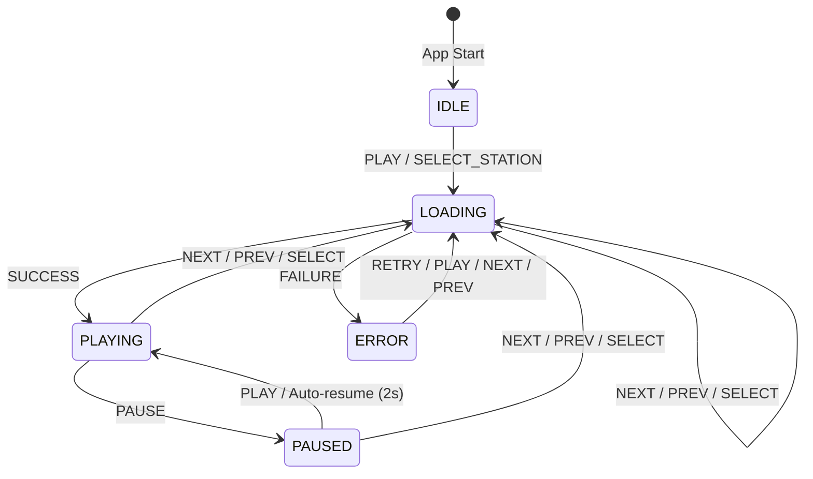

# State Machine for Radio Player - Answer Summary

## Question Asked
> "Can you explain why it would be better to use state machines and can you draw one for this app?"

## Answer Provided ✅

I've created **comprehensive documentation** explaining state machines and their benefits for this radio player app.

---

## 📚 Documentation Files Created

### 1. [STATE_MACHINE.md](./STATE_MACHINE.md) - **Complete Explanation** (14KB)
**What's inside:**
- Detailed explanation of why state machines are better
- Current problems with multiple boolean flags
- Analysis: 8 possible combinations vs 5 valid states
- How state machines prevent impossible states
- Race condition problems explained
- Benefits comparison table
- Two implementation approaches with full code:
  - Simple TypeScript with discriminated unions
  - XState library (recommended)

**Key insight:** 
> "3 boolean flags create 2³ = 8 possible combinations, but only 5 are valid. State machines make impossible states impossible!"

---

### 2. [STATE_MACHINE_DIAGRAM.md](./STATE_MACHINE_DIAGRAM.md) - **Visual Diagram** (8KB)
**What's inside:**
- Interactive Mermaid diagram (renders on GitHub)
- All 5 states with detailed descriptions
- Events table showing all transitions
- Side effects for each state
- Guard conditions
- Context data structure
- Testing strategies
- Comparison: Before vs After
- Visualization tools (XState Inspector, Stately.ai)

**States documented:**
- `IDLE` - Initial state
- `LOADING` - Connecting to stream
- `PLAYING` - Radio is playing
- `PAUSED` - Temporarily paused
- `ERROR` - Connection failed

**Events documented:**
- PLAY, PAUSE, NEXT, PREV, SELECT_STATION, SUCCESS, FAILURE, AUTO_RESUME

---

### 3. [QUICK_REFERENCE.md](./QUICK_REFERENCE.md) - **Quick Lookup** (6KB)
**What's inside:**
- ASCII art state flow diagram
- States summary table
- Events table
- Transition rules (what can go where)
- Code comparison (booleans vs state machine)
- Implementation examples (both simple TS and XState)
- Testing examples
- One-page quick reference

**Perfect for:** Quick lookups when coding

---

### 4. [README.md](./README.md) - **Project Overview** (6KB)
**What's inside:**
- Project introduction
- Quick start guide
- State machine section with links
- Technology stack
- Project structure
- Development workflow
- Current state management explained
- Roadmap with state machine as improvement

**Entry point for new developers**

---

### 5. [state-machine-visualization.html](./public/state-machine-visualization.html) - **Interactive Visual** (8KB)
**What's inside:**
- Beautiful HTML page with CSS styling
- Color-coded state boxes:
  - 🔵 IDLE (blue)
  - 🟡 LOADING (yellow)
  - 🟢 PLAYING (green)
  - 🟠 PAUSED (orange)
  - 🔴 ERROR (red)
- Side-by-side comparison
- Benefits grid (8 advantages)
- Code examples with syntax highlighting
- Responsive design

**View at:** `/public/state-machine-visualization.html`

---

## 🎯 State Machine for Radio Player

### States (5 valid states)

```
┌─────────────────────────────────────────────────┐
│ 1. IDLE     - No radio playing                  │
│ 2. LOADING  - Connecting to stream              │
│ 3. PLAYING  - Radio is playing                  │
│ 4. PAUSED   - Temporarily paused (auto-resume)  │
│ 5. ERROR    - Connection failed                 │
└─────────────────────────────────────────────────┘
```

### State Diagram



### ASCII Diagram

```
                    App Start
                        ↓
                    ┌───────┐
                    │ IDLE  │◄─────────┐
                    └───┬───┘          │
                        │              │
                  PLAY / SELECT        │
                        │              │
                        ▼              │
        ┌───────────────────────────┐ │
        │       LOADING             │ │
        │  • Spinner                │ │
        │  • Loading sound          │ │
        └──┬────────┬───────────┬──┘ │
           │        │           │     │
     FAILURE│       │SUCCESS    │     │
           │        │      NEXT/PREV  │
           │        │      SELECT     │
           ▼        ▼           │     │
       ┌──────┐ ┌──────┐       │     │
       │ERROR │ │PLAYING│       │     │
       └──┬───┘ └───┬──┘       │     │
          │         │           │     │
          │         │PAUSE      │     │
          │         ▼           │     │
    RETRY │     ┌──────┐       │     │
    NEXT  │     │PAUSED│       │     │
    PREV  │     └───┬──┘       │     │
          │         │           │     │
          │         │PLAY/AUTO  │     │
          │         │           │     │
          └─────────┴───────────┘     │
                    │                 │
              NEXT / PREV             │
              SELECT_STATION          │
                    │                 │
                    └─────────────────┘
```

---

## 🎨 Why State Machines Are Better

### Current Problem (Boolean Flags)

```typescript
const [isPlaying, setIsPlaying] = useState(false);
const [isLoading, setIsLoading] = useState(false);
const [hasError, setHasError] = useState(false);
```

**Issues:**
- ❌ **8 possible combinations** (2³) but only 5 are valid
- ❌ **Invalid states possible**: `isPlaying=true AND isLoading=true`
- ❌ **Race conditions**: Multiple setState calls can interleave
- ❌ **Scattered logic**: Transitions spread across many functions
- ❌ **Hard to test**: Must test all 8 combinations
- ❌ **Difficult to debug**: Which state am I really in?

### Solution (State Machine)

```typescript
type State = 'idle' | 'loading' | 'playing' | 'paused' | 'error';
const [state, setState] = useState<State>('idle');
```

**Benefits:**
- ✅ **5 possible values** (all valid!)
- ✅ **Impossible states prevented**: Can only be in ONE state
- ✅ **No race conditions**: Atomic state updates
- ✅ **Centralized logic**: All transitions in one place
- ✅ **Easy to test**: Test 5 states independently
- ✅ **Visual documentation**: Diagram matches code
- ✅ **Type safety**: TypeScript prevents invalid transitions
- ✅ **Better debugging**: Clear current state

---

## 📊 Comparison Table

| Aspect | Boolean Flags | State Machine |
|--------|---------------|---------------|
| **Valid States** | 5 out of 8 | 5 out of 5 |
| **Invalid States** | 3 possible | 0 possible |
| **Race Conditions** | Possible | Prevented |
| **Logic Location** | Scattered | Centralized |
| **Testing** | Complex (8 combos) | Simple (5 states) |
| **Type Safety** | Weak | Strong |
| **Debugging** | console.log hell | Clear state |
| **Documentation** | Comments | Diagram = code |
| **Refactoring** | Risky | Safe |

---

## 💻 Implementation Examples

### Option 1: Simple TypeScript (No Dependencies)

```typescript
type PlayerState = 
  | { status: 'idle' }
  | { status: 'loading'; stationIndex: number }
  | { status: 'playing'; stationIndex: number }
  | { status: 'paused'; stationIndex: number }
  | { status: 'error'; stationIndex: number; error: string };

type PlayerEvent =
  | { type: 'PLAY' }
  | { type: 'PAUSE' }
  | { type: 'NEXT' }
  | { type: 'PREV' }
  | { type: 'SUCCESS' }
  | { type: 'FAILURE'; error: string };

function transition(state: PlayerState, event: PlayerEvent): PlayerState {
  switch (state.status) {
    case 'idle':
      if (event.type === 'PLAY') {
        return { status: 'loading', stationIndex: 0 };
      }
      return state;
    
    case 'loading':
      if (event.type === 'SUCCESS') {
        return { status: 'playing', stationIndex: state.stationIndex };
      }
      if (event.type === 'FAILURE') {
        return { status: 'error', stationIndex: state.stationIndex, error: event.error };
      }
      return state;
    
    case 'playing':
      if (event.type === 'PAUSE') {
        return { status: 'paused', stationIndex: state.stationIndex };
      }
      return state;
    
    case 'paused':
      if (event.type === 'PLAY') {
        return { status: 'playing', stationIndex: state.stationIndex };
      }
      return state;
    
    case 'error':
      if (event.type === 'PLAY') {
        return { status: 'loading', stationIndex: state.stationIndex };
      }
      return state;
  }
}

// Usage
const [state, dispatch] = useReducer(transition, { status: 'idle' });
```

### Option 2: XState (Recommended)

```typescript
import { createMachine } from 'xstate';
import { useMachine } from '@xstate/react';

const radioMachine = createMachine({
  id: 'radio',
  initial: 'idle',
  context: { stationIndex: 0 },
  states: {
    idle: {
      on: { PLAY: 'loading' }
    },
    loading: {
      entry: 'playLoadingSound',
      on: {
        SUCCESS: 'playing',
        FAILURE: 'error',
        NEXT: { target: 'loading', actions: 'incrementStation' },
        PREV: { target: 'loading', actions: 'decrementStation' }
      }
    },
    playing: {
      entry: 'updateMediaSession',
      on: {
        PAUSE: 'paused',
        NEXT: { target: 'loading', actions: 'incrementStation' },
        PREV: { target: 'loading', actions: 'decrementStation' }
      }
    },
    paused: {
      after: { 2000: 'playing' }, // Auto-resume
      on: {
        PLAY: 'playing',
        NEXT: { target: 'loading', actions: 'incrementStation' },
        PREV: { target: 'loading', actions: 'decrementStation' }
      }
    },
    error: {
      entry: 'playErrorSound',
      on: {
        PLAY: 'loading',
        NEXT: { target: 'loading', actions: 'incrementStation' },
        PREV: { target: 'loading', actions: 'decrementStation' }
      }
    }
  }
});

// Usage
const [state, send] = useMachine(radioMachine);
const isLoading = state.matches('loading');
send('PLAY');
```

---

## 🧪 Testing Examples

```typescript
test('loading → playing on success', () => {
  const machine = interpret(radioMachine).start();
  machine.send('PLAY');
  expect(machine.state.value).toBe('loading');
  machine.send('SUCCESS');
  expect(machine.state.value).toBe('playing');
});

test('cannot pause from idle', () => {
  const machine = interpret(radioMachine).start();
  machine.send('PAUSE');
  expect(machine.state.value).toBe('idle'); // stays idle
});

test('auto-resume after 2 seconds', async () => {
  const machine = interpret(radioMachine).start();
  machine.send('PLAY');
  machine.send('SUCCESS');
  machine.send('PAUSE');
  expect(machine.state.value).toBe('paused');
  
  await new Promise(resolve => setTimeout(resolve, 2100));
  expect(machine.state.value).toBe('playing'); // auto-resumed
});
```

---

## 📈 Summary

### Documentation Delivered

✅ **4 markdown files** (36KB total)
- Complete explanation
- Visual diagrams
- Quick reference
- Project overview

✅ **1 HTML visualization** (8KB)
- Interactive visual
- Color-coded states
- Code examples

✅ **Multiple diagram formats**
- Mermaid (GitHub-native)
- ASCII art
- HTML with CSS

✅ **Full implementation guides**
- Simple TypeScript approach
- XState approach
- Testing strategies

### Key Takeaways

1. **State machines prevent impossible states** - Can't be playing AND loading
2. **Transitions are explicit** - Clear rules for state changes
3. **Logic is centralized** - Not scattered across many functions
4. **Testing is easier** - Test each state independently
5. **Debugging is better** - See current state clearly
6. **Code is safer** - TypeScript prevents invalid transitions
7. **Documentation is visual** - Diagram = living documentation

### Next Steps

If you want to implement this:

1. **Choose approach**: Simple TypeScript or XState
2. **Install dependencies** (if XState): `npm install xstate @xstate/react`
3. **Define machine**: Use code examples provided
4. **Refactor component**: Replace boolean flags with state machine
5. **Add tests**: Use testing examples provided
6. **Use dev tools**: XState Inspector for debugging

All code is ready to copy and use! 🚀

---

## 🔗 Quick Links

- [STATE_MACHINE.md](./STATE_MACHINE.md) - Complete explanation
- [STATE_MACHINE_DIAGRAM.md](./STATE_MACHINE_DIAGRAM.md) - Visual diagram  
- [QUICK_REFERENCE.md](./QUICK_REFERENCE.md) - Quick lookup
- [README.md](./README.md) - Project overview
- [state-machine-visualization.html](./public/state-machine-visualization.html) - Interactive visual

---

**Made with ❤️ for better state management! 🎉**
