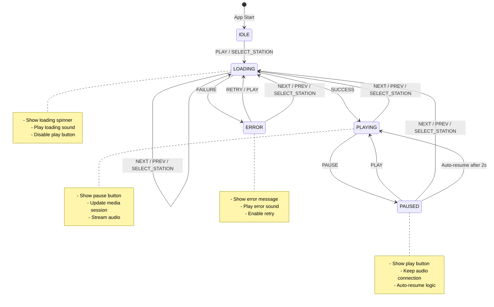

# State Machine for Radio Player App

## Why Use State Machines?

### Current Issues with Boolean State Management

The current implementation uses **multiple boolean flags** to manage state:
```typescript
const [isPlaying, setIsPlaying] = useState(false);
const [isLoading, setIsLoading] = useState(false);
const [hasError, setHasError] = useState(false);
```

This approach has several problems:

#### 1. **Impossible States**
With 3 boolean flags, you can theoretically have 2³ = **8 possible combinations**, but only **4-5 are valid**:
- ✅ `idle` (not playing, not loading, no error)
- ✅ `playing` (playing, not loading, no error)
- ✅ `paused` (not playing, not loading, no error)
- ✅ `loading` (not playing, loading, no error)
- ✅ `error` (not playing, not loading, has error)
- ❌ `playing + loading` - INVALID!
- ❌ `loading + error` - INVALID!
- ❌ `playing + error` - INVALID!

The code must constantly guard against these impossible states, leading to complex conditional logic.

#### 2. **Race Conditions**
Multiple `setState` calls can occur out of order:
```typescript
setIsLoading(true);
setHasError(false);
// If error happens here before loading completes...
setIsLoading(false);
setHasError(true);
```

#### 3. **Unclear State Transitions**
It's not obvious which states can transition to which other states. The logic is scattered across multiple functions:
- `playRadio()` sets loading
- `handlePlayerPlay()` sets playing
- `handlePlayerPause()` clears playing
- Error handlers set error state

#### 4. **Difficult Testing**
Testing all valid state combinations requires understanding the implicit state machine hidden in the code.

---

## Benefits of Explicit State Machines

### 1. **Impossible States Become Impossible**
```typescript
type PlayerState = 
  | { status: 'idle' }
  | { status: 'loading'; stationIndex: number }
  | { status: 'playing'; stationIndex: number }
  | { status: 'paused'; stationIndex: number }
  | { status: 'error'; stationIndex: number; error: Error };
```

You can only be in ONE state at a time. No more `isPlaying && isLoading` scenarios!

### 2. **Explicit Transitions**
State machines make transitions explicit:
```typescript
// From 'idle' you can only go to 'loading'
// From 'loading' you can go to 'playing' or 'error'
// From 'playing' you can go to 'paused' or 'loading' (station change)
```

### 3. **Centralized Logic**
All state management logic lives in one place, making it easier to:
- Understand the app flow
- Debug issues
- Add new features
- Refactor safely

### 4. **Better Developer Experience**
- IDEs can autocomplete valid states
- TypeScript catches invalid transitions at compile time
- Visual diagrams serve as documentation

### 5. **Easier Testing**
Test each state and transition independently:
```typescript
test('loading -> playing transition', () => {
  const machine = createMachine();
  machine.send('PLAY');
  expect(machine.state).toBe('loading');
  machine.send('SUCCESS');
  expect(machine.state).toBe('playing');
});
```

---

## Radio Player State Machine

### States

1. **IDLE** - Initial state, no radio selected
2. **LOADING** - Connecting to radio stream
3. **PLAYING** - Radio stream is playing
4. **PAUSED** - Radio stream is paused
5. **ERROR** - Failed to load radio stream

### Events (User Actions)

- `PLAY` - User presses play button
- `PAUSE` - User presses pause button
- `NEXT` - User presses next station button
- `PREV` - User presses previous station button
- `SELECT_STATION` - User selects a station from dropdown
- `SUCCESS` - Radio stream loaded successfully
- `FAILURE` - Radio stream failed to load
- `RETRY` - User retries after error

### State Machine Diagram



### Visual Representation (ASCII)

```
           ┌─────────────────────────────────────┐
           │           App Start                 │
           └─────────────┬───────────────────────┘
                         ▼
                    ┌────────┐
                    │  IDLE  │ 
                    └────┬───┘
                         │ PLAY / SELECT_STATION
                         ▼
          ┌──────────────────────────────────────┐
          │          LOADING                     │
          │  - Show loading animation            │
          │  - Play loading sound                │
          │  - Fetch audio stream                │
          └──┬────────┬──────────┬───────────────┘
             │        │          │
    FAILURE │        │ SUCCESS  │ NEXT/PREV/SELECT
             │        │          │
             ▼        ▼          └──────┐
        ┌────────┐ ┌─────────┐        │
        │ ERROR  │ │ PLAYING │        │
        └───┬────┘ └───┬─────┘        │
            │          │               │
    RETRY   │          │ PAUSE         │
    NEXT    │          │               │
    PREV    │          ▼               │
            │      ┌────────┐          │
            │      │ PAUSED │          │
            │      └───┬────┘          │
            │          │               │
            │          │ PLAY          │
            │          │ (auto-resume) │
            │          │               │
            └──────────┴───────────────┘
                       │
                NEXT / PREV / SELECT
                       │
                       ▼
                  (to LOADING)
```

---

## Current vs State Machine Comparison

### Current Implementation (Multiple Booleans)

```typescript
// Current state representation
const [isPlaying, setIsPlaying] = useState(false);
const [isLoading, setIsLoading] = useState(false);
const [hasError, setHasError] = useState(false);

// Scattered transition logic
const playRadio = (index: number) => {
  setIsLoading(true);
  setHasError(false);
  // ... more logic
};

const handlePlayerPlay = () => {
  setIsPlaying(true);
  // ... more logic
};

// Problem: Can't guarantee valid state combinations
// Problem: Transition logic is scattered
// Problem: Easy to introduce bugs
```

### With State Machine

```typescript
// Single source of truth
type State = 
  | { value: 'idle' }
  | { value: 'loading'; context: { stationIndex: number } }
  | { value: 'playing'; context: { stationIndex: number } }
  | { value: 'paused'; context: { stationIndex: number } }
  | { value: 'error'; context: { stationIndex: number; error: Error } };

// Centralized transition logic
const machine = {
  idle: {
    PLAY: 'loading',
    SELECT_STATION: 'loading'
  },
  loading: {
    SUCCESS: 'playing',
    FAILURE: 'error',
    NEXT: 'loading',
    PREV: 'loading'
  },
  playing: {
    PAUSE: 'paused',
    NEXT: 'loading',
    PREV: 'loading'
  },
  paused: {
    PLAY: 'playing',
    NEXT: 'loading',
    PREV: 'loading'
  },
  error: {
    RETRY: 'loading',
    NEXT: 'loading',
    PREV: 'loading'
  }
};

// Benefits:
// ✅ Only valid states possible
// ✅ Clear transitions
// ✅ Easy to understand and test
// ✅ Visual diagram matches code
```

---

## Implementation Approaches

### Option 1: Simple TypeScript State Machine

```typescript
type PlayerState = 
  | { status: 'idle' }
  | { status: 'loading'; stationIndex: number }
  | { status: 'playing'; stationIndex: number }
  | { status: 'paused'; stationIndex: number }
  | { status: 'error'; stationIndex: number; error: string };

type PlayerEvent =
  | { type: 'PLAY' }
  | { type: 'PAUSE' }
  | { type: 'NEXT' }
  | { type: 'PREV' }
  | { type: 'SELECT_STATION'; index: number }
  | { type: 'SUCCESS' }
  | { type: 'FAILURE'; error: string };

function transition(state: PlayerState, event: PlayerEvent): PlayerState {
  switch (state.status) {
    case 'idle':
      if (event.type === 'PLAY' || event.type === 'SELECT_STATION') {
        return { 
          status: 'loading', 
          stationIndex: event.type === 'SELECT_STATION' ? event.index : 0 
        };
      }
      return state;
    
    case 'loading':
      if (event.type === 'SUCCESS') {
        return { status: 'playing', stationIndex: state.stationIndex };
      }
      if (event.type === 'FAILURE') {
        return { status: 'error', stationIndex: state.stationIndex, error: event.error };
      }
      if (event.type === 'NEXT' || event.type === 'PREV' || event.type === 'SELECT_STATION') {
        // Calculate new station index
        return { status: 'loading', stationIndex: /* calculate */ };
      }
      return state;
    
    case 'playing':
      if (event.type === 'PAUSE') {
        return { status: 'paused', stationIndex: state.stationIndex };
      }
      if (event.type === 'NEXT' || event.type === 'PREV' || event.type === 'SELECT_STATION') {
        return { status: 'loading', stationIndex: /* calculate */ };
      }
      return state;
    
    case 'paused':
      if (event.type === 'PLAY') {
        return { status: 'playing', stationIndex: state.stationIndex };
      }
      if (event.type === 'NEXT' || event.type === 'PREV' || event.type === 'SELECT_STATION') {
        return { status: 'loading', stationIndex: /* calculate */ };
      }
      return state;
    
    case 'error':
      if (event.type === 'PLAY' || event.type === 'NEXT' || event.type === 'PREV' || event.type === 'SELECT_STATION') {
        return { status: 'loading', stationIndex: /* calculate */ };
      }
      return state;
  }
}

// Usage in component
const [state, dispatch] = useReducer(transition, { status: 'idle' });
```

### Option 2: XState Library (Recommended)

XState is a popular state machine library that provides:
- Visual state chart editor
- TypeScript support
- Dev tools for debugging
- Testing utilities

```typescript
import { createMachine, assign } from 'xstate';
import { useMachine } from '@xstate/react';

const radioMachine = createMachine({
  id: 'radio',
  initial: 'idle',
  context: {
    stationIndex: 0,
    error: null
  },
  states: {
    idle: {
      on: {
        PLAY: 'loading',
        SELECT_STATION: {
          target: 'loading',
          actions: assign({ stationIndex: (_, event) => event.index })
        }
      }
    },
    loading: {
      entry: ['playLoadingSound', 'startStreaming'],
      on: {
        SUCCESS: 'playing',
        FAILURE: {
          target: 'error',
          actions: assign({ error: (_, event) => event.error })
        },
        NEXT: {
          target: 'loading',
          actions: 'incrementStation'
        },
        PREV: {
          target: 'loading',
          actions: 'decrementStation'
        }
      }
    },
    playing: {
      entry: 'updateMediaSession',
      on: {
        PAUSE: 'paused',
        NEXT: {
          target: 'loading',
          actions: 'incrementStation'
        },
        PREV: {
          target: 'loading',
          actions: 'decrementStation'
        }
      }
    },
    paused: {
      after: {
        2000: 'playing' // Auto-resume after 2 seconds
      },
      on: {
        PLAY: 'playing',
        NEXT: {
          target: 'loading',
          actions: 'incrementStation'
        },
        PREV: {
          target: 'loading',
          actions: 'decrementStation'
        }
      }
    },
    error: {
      entry: 'playErrorSound',
      on: {
        PLAY: 'loading',
        NEXT: {
          target: 'loading',
          actions: 'incrementStation'
        },
        PREV: {
          target: 'loading',
          actions: 'decrementStation'
        }
      }
    }
  }
});

// Usage in component
export function App() {
  const [state, send] = useMachine(radioMachine);
  
  // Simple checks
  const isLoading = state.matches('loading');
  const isPlaying = state.matches('playing');
  const hasError = state.matches('error');
  
  // Send events
  const handlePlay = () => send('PLAY');
  const handlePause = () => send('PAUSE');
  const handleNext = () => send('NEXT');
  
  return (
    // UI based on state.value
  );
}
```

---

## Summary: Why State Machines Are Better

| Aspect | Boolean Flags | State Machine |
|--------|---------------|---------------|
| **Impossible States** | Possible (8 combinations) | Impossible (5 valid states) |
| **Clarity** | Scattered logic | Centralized transitions |
| **Testing** | Complex conditional logic | Test each state/transition |
| **Debugging** | Console.log hell | Visual state inspector |
| **Documentation** | Comments (out of date) | Diagram = code |
| **Type Safety** | Weak | Strong (discriminated unions) |
| **Race Conditions** | Possible | Prevented by design |
| **Maintenance** | Hard to refactor | Easy to add states |

### Key Takeaway

**State machines transform implicit, scattered state management into explicit, visual, type-safe code that's easier to understand, test, and maintain.**

For this radio player, a state machine would:
1. ✅ Prevent impossible states (playing + loading)
2. ✅ Make transitions explicit and predictable
3. ✅ Simplify error handling
4. ✅ Enable better testing
5. ✅ Serve as living documentation
6. ✅ Make future changes safer

---

## Next Steps

To implement a state machine for this app:

1. Choose an approach (simple TS or XState)
2. Define all states and events
3. Implement the transition function
4. Refactor component to use state machine
5. Add tests for state transitions
6. Update documentation

Would you like me to implement this using XState or a simpler TypeScript approach?
