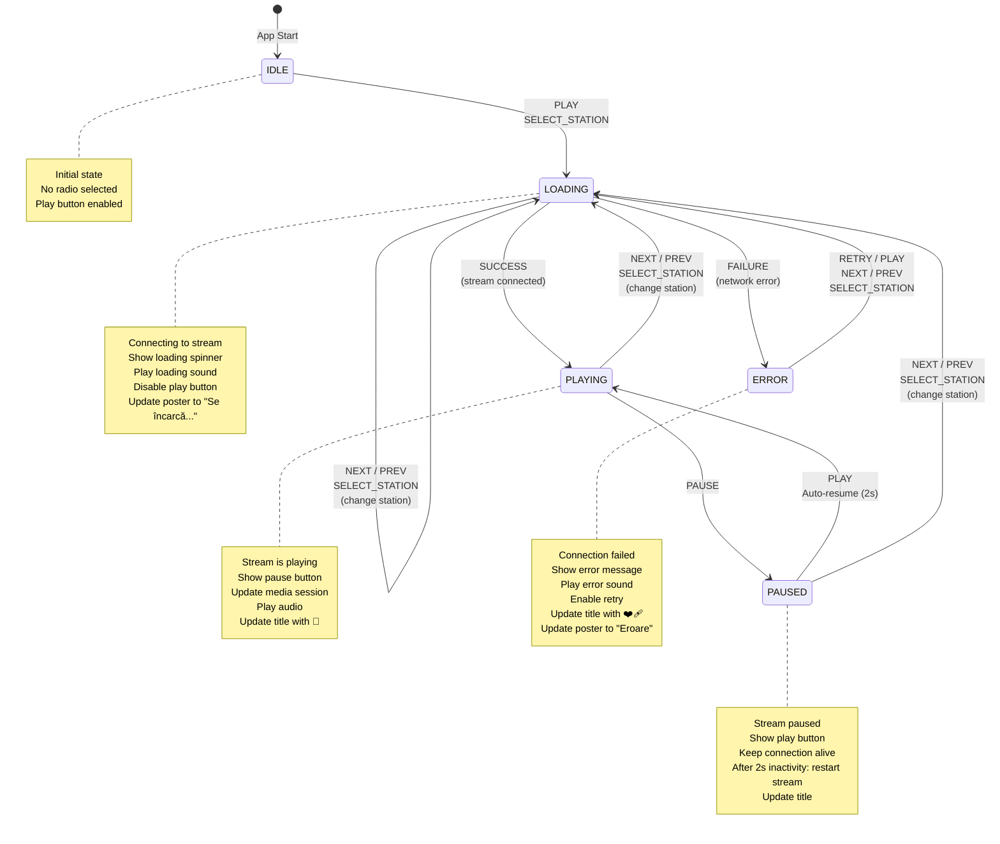

# Radio Player State Machine Diagram

This document contains the visual state machine diagram for the radio player application.

## Interactive State Diagram



## State Details

### IDLE State
- **Entry Actions**: None
- **UI**: Play button visible, no station playing
- **Exit Actions**: None
- **Valid Transitions**: → LOADING

### LOADING State
- **Entry Actions**: 
  - Set loading indicator
  - Play loading sound
  - Disable play/pause buttons
  - Update poster image to "Se încarcă..."
  - Update document title with ⏳
- **UI**: Loading spinner, disabled controls
- **Exit Actions**: Stop loading sound
- **Valid Transitions**: → PLAYING, → ERROR, → LOADING (station change)

### PLAYING State
- **Entry Actions**:
  - Stop loading sound
  - Update media session metadata
  - Show pause button
  - Update document title with 🔴
  - Update poster image with station name
- **UI**: Pause button visible, audio playing
- **Exit Actions**: None
- **Valid Transitions**: → PAUSED, → LOADING (station change)

### PAUSED State
- **Entry Actions**:
  - Show play button
  - Record pause timestamp
- **UI**: Play button visible, audio paused
- **Delayed Actions**: After 2000ms → restart stream (→ PLAYING)
- **Exit Actions**: Clear pause timestamp
- **Valid Transitions**: → PLAYING, → LOADING (station change)

### ERROR State
- **Entry Actions**:
  - Stop loading sound
  - Play error sound
  - Show error message
  - Update document title with ❤️‍🩹
  - Update poster image to "Eroare"
  - Enable all controls
- **UI**: Error message, retry enabled
- **Exit Actions**: Stop error sound
- **Valid Transitions**: → LOADING

## Events

| Event | Description | From States | To State |
|-------|-------------|-------------|----------|
| **PLAY** | User clicks play button | IDLE, PAUSED, ERROR | LOADING or PLAYING |
| **PAUSE** | User clicks pause button | PLAYING | PAUSED |
| **NEXT** | User clicks next button | ALL | LOADING |
| **PREV** | User clicks previous button | ALL | LOADING |
| **SELECT_STATION** | User selects from dropdown | ALL | LOADING |
| **SUCCESS** | Stream connected successfully | LOADING | PLAYING |
| **FAILURE** | Stream connection failed | LOADING | ERROR |
| **AUTO_RESUME** | 2s pause timeout | PAUSED | PLAYING |

## Context Data

The state machine maintains context data:

```typescript
{
  stationIndex: number;      // Current selected station (0-17)
  error: Error | null;       // Error details if in ERROR state
  lastPauseTime: number | null; // Timestamp of last pause
}
```

## Side Effects by State

### LOADING State Side Effects
1. Call `player.pause()`
2. Set `player.src = radioStations[index].url`
3. Call `player.load()`
4. Call `player.play()` (async)
5. Play loading noise via `loadingNoiseInstance.play()`

### PLAYING State Side Effects
1. Stop loading noise via `loadingNoiseInstance.stop()`
2. Update `navigator.mediaSession.metadata`
3. Update document title
4. Update poster image

### ERROR State Side Effects
1. Stop loading noise
2. Play error noise via `errorNoiseInstance.play()`
3. Log error to console
4. Update UI with error message

## Guard Conditions

Some transitions have guard conditions:

| Transition | Guard | Description |
|------------|-------|-------------|
| PAUSED → PLAYING | timeDiff > 2000ms | Auto-resume only after 2s |
| IDLE → PLAYING | has player.src | Skip loading if already loaded |
| Any → LOADING | AbortError | Ignore abort errors during load |

## Comparison: Before vs After

### Before (Current Implementation)
```typescript
// 3 boolean flags = 8 possible states (3 invalid!)
const [isPlaying, setIsPlaying] = useState(false);
const [isLoading, setIsLoading] = useState(false);
const [hasError, setHasError] = useState(false);

// Transition logic scattered across multiple functions
// Hard to visualize, easy to introduce bugs
```

### After (State Machine)
```typescript
// 1 state value = 5 possible states (all valid!)
type State = 'idle' | 'loading' | 'playing' | 'paused' | 'error';
const [state, setState] = useState<State>('idle');

// Or with XState for better tooling
const [state, send] = useMachine(radioMachine);
```

## Testing Strategy

With a state machine, you can test:

1. **State Transitions**: Each transition works correctly
   ```typescript
   test('LOADING → PLAYING on SUCCESS', () => {
     const machine = interpret(radioMachine).start();
     machine.send('PLAY');
     expect(machine.state.value).toBe('loading');
     machine.send('SUCCESS');
     expect(machine.state.value).toBe('playing');
   });
   ```

2. **Invalid Transitions**: Invalid transitions are ignored
   ```typescript
   test('Cannot PAUSE from IDLE', () => {
     const machine = interpret(radioMachine).start();
     machine.send('PAUSE');
     expect(machine.state.value).toBe('idle'); // stays idle
   });
   ```

3. **Context Updates**: Context is updated correctly
   ```typescript
   test('NEXT increments station index', () => {
     const machine = interpret(radioMachine).start();
     machine.send({ type: 'SELECT_STATION', index: 0 });
     machine.send('NEXT');
     expect(machine.state.context.stationIndex).toBe(1);
   });
   ```

4. **Side Effects**: Entry/exit actions execute
   ```typescript
   test('LOADING entry plays loading sound', () => {
     const playLoadingSound = jest.fn();
     const machine = interpret(radioMachine.withConfig({
       actions: { playLoadingSound }
     })).start();
     machine.send('PLAY');
     expect(playLoadingSound).toHaveBeenCalled();
   });
   ```

## Visualization Tools

For XState implementations, you can use:
- **[XState Visualizer](https://stately.ai/viz)**: Online tool to visualize and test state machines
- **[XState Inspector](https://stately.ai/docs/inspector)**: Browser extension for debugging
- **Stately Studio**: Professional state machine editor

These tools let you:
- ✅ See current state in real-time
- ✅ Time-travel through state changes
- ✅ Test transitions interactively
- ✅ Export diagrams
- ✅ Share with team

## Summary

This state machine provides:
1. **Clear documentation** - The diagram is the spec
2. **Type safety** - Invalid states are impossible
3. **Testability** - Each transition can be tested
4. **Maintainability** - Easy to add new states/transitions
5. **Debugging** - Visual tools show current state
6. **Predictability** - All transitions are explicit

The radio player has clear, predictable behavior that matches the visual diagram!
